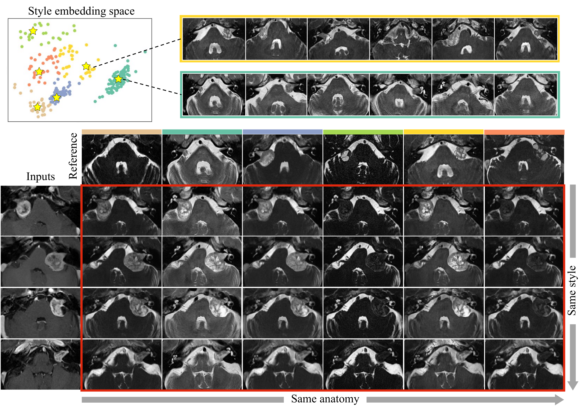

# IntraStyler: Intra-Domain Style Synthesis for Cross-Modality MRI Domain Adaptation

**MICCAI 2026 (Early Accept, top 9%)** | [Paper](assets/paper.pdf) | [MedICL Lab](https://github.com/MedICL-VU)

> Han Liu, Yubo Fan, Hao Li, Dewei Hu, Daniel Moyer, Zhoubing Xu, Benoit Dawant, Ipek Oguz

## Overview

**IntraStyler** is a 3D unpaired image translation method that automatically discovers fine-grained intra-domain styles without any predefined sub-domains, and synthesizes diverse target domain images using per-image style references. It is built upon the **1st place CrossMoDA challenge solution** and further advances it by generating more diverse synthetic data and achieving more reliable downstream segmentation.

### Key Idea

<p align="center">
  
</p>

In cross-modality domain adaptation, images from the same target domain (e.g., T2 MRI) often exhibit substantial appearance variation due to different scanners, field strengths, and acquisition protocols. Previous methods require predefined sub-domain labels to synthesize diverse styles, but such labels are often unavailable or too coarse. **IntraStyler treats each target domain image as its own style reference**, enabling fine-grained style control without any sub-domain annotations.

### Highlights

- **Sub-domain-free style synthesis**: Discovers and synthesizes diverse intra-domain styles without requiring any predefined sub-domain labels.
- **Contrastive style encoder**: A 3D style encoder trained with a novel contrastive learning objective extracts style-only embeddings disentangled from anatomical content.
- **Style interpolation via SLERP**: Supports smooth style blending between two reference images using spherical linear interpolation.
- **State-of-the-art performance**: Achieves superior downstream segmentation on the CrossMoDA challenge benchmark compared to prior methods.

## Method

<p align="center">
  
</p>

IntraStyler consists of two main components:

1. **Style Encoder ($E_S$)**, trained via contrastive learning to extract per-image style embeddings that are invariant to anatomy but sensitive to appearance changes.
2. **Synthesis Network ($G$)**, a 3D QS-Attn backbone conditioned on the extracted style embedding via Dynamic Instance Normalization (DIN) layers for controllable style synthesis.

### Training Objective

$$L_{\text{IntraStyler}} = \underbrace{L_{\text{adv}} + \lambda_{\text{NCE}} L_{\text{PatchNCE}}}_{\text{QS-Attn}} + \underbrace{\lambda_{\text{style}} L_{\text{style}}}_{\text{style discrimination}} + \underbrace{\lambda_{\text{con}} L_{\text{con}}}_{\text{style consistency}}$$

where $\lambda_{\text{style}} = \lambda_{\text{con}} = 5$, style vector dimension $K = 256$, temperature $\tau = 0.01$, and $N = 8$ negative samples per iteration.

### Contrastive Learning for Style

- **Query**: a 3D patch randomly cropped from a target domain image.
- **Positive**: another patch from the same image (same style, different anatomy).
- **Negatives**: intensity-perturbed versions of the positive (same anatomy, different style).

Perturbations include random contrast adjustment, Gaussian smoothing, Gaussian noise, bias field corruption, and random mixtures. These simulate dominant physical sources of MRI appearance variation.

### Style Interpolation

<p align="center">
  
</p>

Given two reference style embeddings $v_0$ and $v_1$, new styles can be smoothly interpolated via SLERP:

$$\text{SLERP}(v_0, v_1; t) = \frac{\sin((1-t)\theta)}{\sin(\theta)} v_0 + \frac{\sin(t\theta)}{\sin(\theta)} v_1$$

## Dataset

Evaluated on the [CrossMoDA challenge](https://crossmoda.grand-challenge.org/) benchmark:

| | Source Domain | Target Domain |
|---|---|---|
| **Modality** | Contrast-enhanced T1 MRI | T2 MRI |
| **# Training** | 226 (labeled) | 295 (unlabeled) |
| **# Test** | | 96 |
| **Structures** | Vestibular schwannoma (intra/extra-meatal) + Cochlea |
| **Variability** | Multi-institute, multi-scanner (Siemens, Philips, GE, Hitachi), multi-field-strength (1.0T, 1.5T, 3.0T) |

## Repository Structure

Source code is available at [https://github.com/han-liu/IntraStyler](https://github.com/han-liu/IntraStyler).

```
IntraStyler/
├── synthesis/          # Image translation (training, inference, style extraction)
│   ├── train.py
│   ├── inference3d.py
│   ├── inference3d_slerp.py
│   ├── get_embeddings.py
│   ├── latent_analysis.py
│   ├── models/
│   ├── data/
│   ├── options/
│   └── requirements.txt
├── segmentation/       # Downstream segmentation (nnU-Net based)
│   ├── jobs/
│   └── src/
├── utils/              # Preprocessing and postprocessing
│   ├── preprocess.py
│   ├── crop_roi.py
│   ├── invert_pred.py
│   └── putback.py
└── LICENSE
```

## Usage

### Installation

```bash
git clone https://github.com/MedICL-VU/IntraStyler.git
cd IntraStyler/synthesis
pip install -r requirements.txt
```

### Training (Synthesis)

```bash
python train.py -n <experiment_name> --model style --netG resnet_9blocks_style --display_id 0
```

### Inference (Style-conditioned Synthesis)

```bash
python inference3d.py -n <experiment_name> --model style --netG resnet_9blocks_style
```

### Style Interpolation (SLERP)

```bash
python inference3d_slerp.py -n <experiment_name> --model style --netG resnet_9blocks_style
```

### Extract Style Embeddings

```bash
python get_embeddings.py -n <experiment_name> --model style --netG resnet_9blocks_style
```

### Downstream Segmentation

Segmentation uses [nnU-Net](https://github.com/MIC-DKFZ/nnUNet). See `segmentation/` for details.

## Results

<p align="center">
  
</p>

IntraStyler achieves state-of-the-art segmentation on the CrossMoDA benchmark, outperforming all sub-domain-based methods with fewer failure cases and higher robustness across heterogeneous scanners. See the paper for detailed quantitative comparisons.

## Citation

```bibtex
@inproceedings{liu2026intrastyler,
  title={IntraStyler: Intra-Domain Style Synthesis for Cross-Modality MRI Domain Adaptation},
  author={Liu, Han and Fan, Yubo and Li, Hao and Hu, Dewei and Moyer, Daniel and Xu, Zhoubing and Dawant, Benoit and Oguz, Ipek},
  booktitle={Medical Image Computing and Computer Assisted Intervention (MICCAI)},
  year={2026}
}
```

## Acknowledgements

This work builds upon:
- [QS-Attn](https://github.com/sapphire497/query-selected-attention) (synthesis backbone)
- [CrossMoDA Challenge](https://crossmoda.grand-challenge.org/) (benchmark dataset)
- [nnU-Net](https://github.com/MIC-DKFZ/nnUNet) (segmentation framework)

## License

This project is licensed under the Apache-2.0 License. See [LICENSE](LICENSE) for details.
